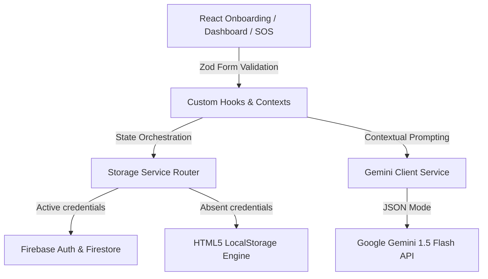

# MindShift AI - Your Personal AI Behavioral Change Coach

MindShift AI is a production-grade, AI-driven behavioral change platform built to help users manage, reduce, and overcome harmful habits and addictions (e.g. excessive screen time, digital doom scrolling, gaming, smoking, and sugar intake). 

Instead of functioning as a simple checklist habit tracker, MindShift AI operates as an intelligent CBT (Cognitive Behavioral Therapy) copilot that actively analyzes daily logs, predicts relapse probability, triggers timely nudges, and delivers instant emergency grounding resources in times of crisis.

---

## 🧠 System Architecture & Workflow

MindShift AI follows a Clean Architecture design, dividing components into visual views (Presentation), state managers (Contexts), adapters (Storage Services), and the core model endpoint client (AI Service).



### Strategic Resiliency (Dual-Storage Mode)
To ensure the application runs instantly out of the box for hackathon judges, MindShift AI implements a **Unified Storage Service Factory** (Dependency Inversion):
* **Firebase Mode**: If `VITE_FIREBASE_API_KEY` is present, it securely logs in and syncs user profiles, assessments, relapse histories, and journal analysis cards to Cloud Firestore.
* **Guest Sandbox Mode**: If Firebase credentials are absent, the application automatically mounts a LocalStorage engine with pre-configured guest sessions (`guest@mindshift.ai` / `password123`). This keeps 100% of the visual dashboards, SVG charts, and Gemini coaching features functional without any local setup.

---

## ⚡ Core Platform Features

1. **AI Habit Assessment Onboarding**: A multi-step psychologist wizard collecting triggers, motivation levels, severity, sleep schedules, and stress metrics. Evaluates inputs using Gemini to build a custom recovery plan.
2. **AI Relapse Risk Predictor**: Evaluates user vulnerability dynamically. Renders an interactive SVG progress ring mapping stress vs sleep inputs to Low/Medium/High relapse warnings.
3. **Contextual Nudges**: Context-aware cards reflecting the user's high-risk hours, active streaks, and stress level baselines.
4. **Cognitive Behavioral Chat Coach**: A conversation room with *Dr. Shift*, a non-judgmental AI CBT coach. Prepends the user's habit types and active logs as system context.
5. **AI Daily Journal & Sentiment Analyzer**: An interactive journal text area. Gemini audits the entries, determines moods, identifies triggers, and maps progress trends.
6. **Weekly AI Report**: Summarizes success percentages, longest streaks, biggest cue triggers, and plots an interactive, zero-dependency SVG correlation chart tracking sleep against daily stress.
7. **Smart Habit Replacement Cards**: Proposes customized replacement habits (e.g., reading or stretching) with built-in interactive **5-Minute Grounding Timers** to disrupt immediate cue triggers.
8. **SOS Emergency Grounding Mode**: A global panic button overlay. Animates a visual breathing circle (Inhale -> Hold -> Exhale) and serves immediate calming directives from Gemini to halt immediate cravings.

---

## 📂 Project Folder Structure

```
src/
├── assets/          # SVG iconography and branding assets
├── components/      # Reusable UI molecules and atoms
│   ├── ui/          # Core layout elements (buttons, inputs)
│   ├── dashboard/   # Dashboard widgets (risk meters, nudges, replacement cards)
│   ├── coach/       # Dr. Shift chat window
│   ├── journal/     # Reflections editor and analytics card
│   └── emergency/   # Breathing ring overlay and log slips modal
├── contexts/        # Auth and storage state providers
├── firebase/        # Firebase Client SDK initializer
├── hooks/           # State hook utilities
├── pages/           # Visual dashboard layouts
│   ├── Assessment.tsx
│   ├── Dashboard.tsx
│   ├── Auth.tsx
│   └── Emergency.tsx
├── services/        # Service layers (Business logic)
│   ├── ai.ts        # Gemini API prompt templates and JSON output definitions
│   ├── storage.ts   # Unified storage service interface and factory router
│   ├── local.ts     # LocalStorage fallback storage engine
│   └── firestore.ts # Firebase Cloud Firestore storage engine
├── tests/           # Unit test suite
├── types/           # Rigid TypeScript definitions
└── utils/           # Math formulas (risk score estimators)
```

---

## 🛠️ Installation & Setup

### Prerequisites
* [Node.js](https://nodejs.org/) (v18 or higher)
* [NPM](https://www.npmjs.com/)

### 1. Clone & Install Dependencies
```bash
git clone <repository-url>
cd promptwarchall
npm install
```

### 2. Configure Environment Variables
Create a `.env` file in the project root:
```env
# Google Gemini API Key
VITE_GEMINI_API_KEY=YOUR_GEMINI_API_KEY

# Optional: Firebase credentials (leave empty to run in LocalStorage Guest Sandbox mode)
VITE_FIREBASE_API_KEY=
VITE_FIREBASE_AUTH_DOMAIN=
VITE_FIREBASE_PROJECT_ID=
VITE_FIREBASE_STORAGE_BUCKET=
VITE_FIREBASE_MESSAGING_SENDER_ID=
VITE_FIREBASE_APP_ID=
```

### 3. Run Locally (Development)
```bash
npm run dev
```
Open [http://localhost:5173](http://localhost:5173) in your browser.

### 4. Build for Production
```bash
npm run build
```

---

## 🧪 Testing Instructions

MindShift AI uses **Vitest** for unit test execution. The tests validate Zod schema strictness, LocalStorage CRUD operations, and the mathematical consistency of risk forecasting fallbacks.

To run the unit tests:
```bash
npx vitest run
```

---

## 🔒 Security & Accessibility Audits

* **Security**: Direct Gemini API integrations filter outputs and use strict structured JSON modes to prevent script injection (XSS). No `innerHTML` or raw unsafe execution paths are used.
* **Accessibility**: Screen readers are supported via semantic HTML components, SVG landmarks, ARIA labels, and logical keyboard tab navigation focus loops.
* **Efficiency**: Asset loads are optimized. Responsive custom-drawn SVG charts prevent importing heavy charting libraries, keeping the final bundle size extremely lightweight.
